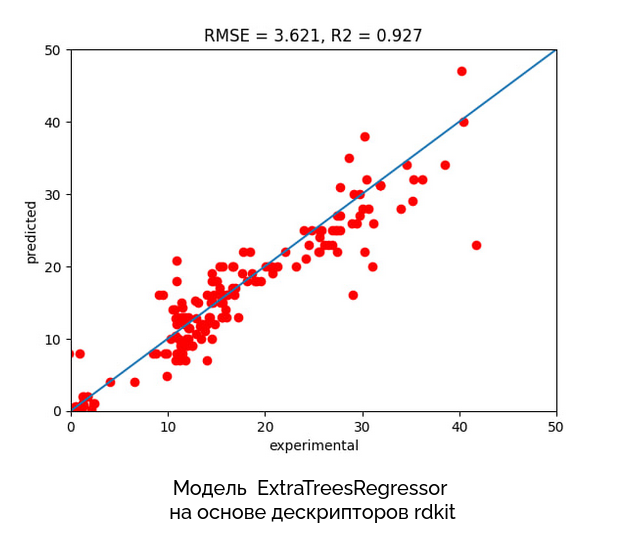

# Хакатон Построение предсказательной модели регрессии для прогнозирования ZOI 
(зоны ингибирования роста бактерий)

- Team 5: Кулаев Кирилл, Алтышева Мария, Дедова Анастасия, Обухова Арина, Потуданская Мария 

## Описание задачи
Резистентность к антибиотикам — серьезная проблема современной медицины. Заболевания, которые вызваны резистентными бактериями, с трудом поддаются лечению, а иногда и вовсе не лечатся. Для борьбы с такими бактериями биологи и медики постоянно ищут новые подходы, и один из вариантов — терапия металлическими наночастицами. Металлические наночастицы могут как воздействовать на бактерии самостоятельно (повреждая мембраны бактерий и генерируя радикальные частицы), так и усиливать эффект антибиотиков.

Задание состоит в построении предсказательной модели регрессии для прогнозирования ZOI - зоны игибирования роста бактерий - для комплексов лекарство-наночастицы.

[Описание данных](data_description.md)

## Основной baseplain:

https://github.com/MariaAltisheva/hackathon/blob/main/DC_team_5.ipynb

## Презентация:

https://docs.google.com/presentation/d/1PE2hwT6_obFj18qIl-fcInDLH_cO0Hslj-w15GeXdgg/edit#slide=id.p 

## Работа с пропусками
1. Удалены столбцы Unnamed: 0.1, Drug_dose, NP_concentration, fold_increase_in_antibacterial_activity.
2. Объединялись датасеты по колонкам Drug и Bacteria
3. После построения heat map, анализа свойств некоторых фич, удалены колонки: subkingdom, clade, kingdom, phylum, class, order, family, species, Tax_id, isolated_from.
4. В столбце ZOI_drug пропущенные значения были заменены на среднее.
5. Пустые строки method, shape, NP_Syntesis, NP size_min, NP size_max, NP size_avg, ZOI_NP были удалены.
6. Строки с пропущенными значениями по столбцам min_Incub_period, avg_Incub_period, max_incub_period, growth_temp, biosafety_level были заменены средними значениями. 
7. Были удалены max_incub_period,  min_Incub_period и NP size_max как максимально коррелирующие признаки.
8. Были подсчитаны все дескрипторы для всех молекул антибиотиков.

## Корреляция признаков итогового датасета

До удаления сильно коррелирующих признаков

После удаления сильно коррелирующих признаков, добавления новых дескрипторов

## Анализ метрик предсказания различных моделей МО

## Метрики качества модели GradientBoostingRegressor

До удаления ['fr_nitro_arom', 'MDR_check'] 

После удаления ['fr_nitro_arom', 'MDR_check']

## Влияние фич на качество прогноза модели GradientBoostingRegressor

##